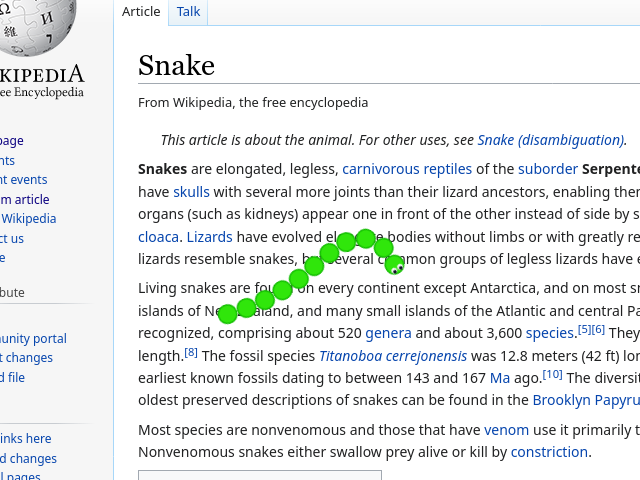
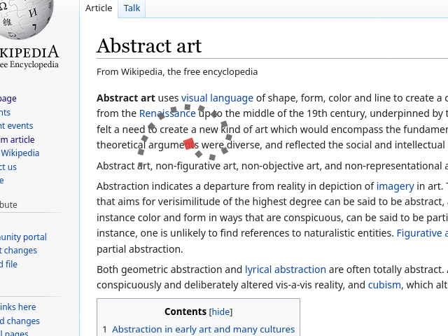
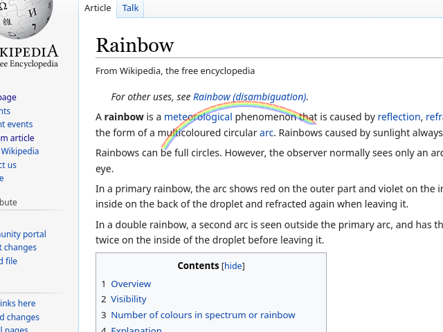
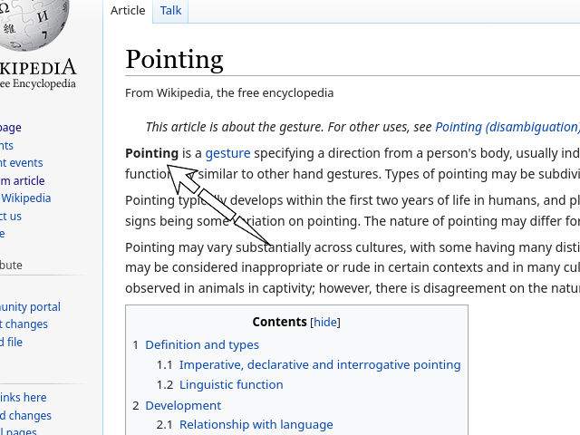

# Mouse Pet

This is a simple Firefox WebExtension that adds a small pet snake following your cursor. It's really customizable too!

- You can change the length, size and opacity of the pet.
- There's several different skins you can choose.
- And if your pet tends to get in the way, you can tell it to disappear whenever the mouse isn't moving (with a configurable timeout) so that it can stop bothering you.

## Screenshots

This is the default skin, a green cartoon snake.

If you don't like it, you can go for a more abstract style.

And there's also a rainbow! Because why not?

There's also a cursor skin, which can come in handy when you have to do some screen recording but your normal mouse cursor isn't being captured.
